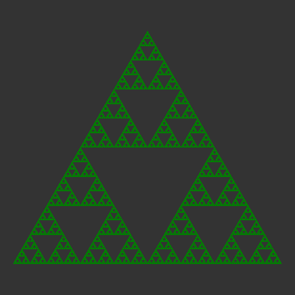

# Welcome to the ****Chaos Game** Visualizer**

  
<strong>Table of Contents</strong>

  <ol>
    <li><a href="#What-is-Chaos-Game">What is <strong>Chaos Game</strong></a>
      <ul>
        <li><a href="#here's-how-it-works:">How the algorithm works</a></li>
      </ul>
    </li>
    <li><a href="#motivation:-testing-the-chaos-game">Motivation</a></li>
    <li><a href="#how-to-use">How to Use</a></li>
    <li><a href="#tools-used">Tools Used</a>
      <ul>
        <li><a href="#programming-languages">Programming Language(s)</a></li>
        <li><a href="#libraries">Libraries</a></li>
      </ul>
    </li>
    <li><a href="#expected-output">Expected Output</a></li>
    <li><a href="#future-work">Future Work</a></li>
    <li><a href="#references">References</a></li>
  </ol>

## What is **Chaos Game**  
The **Chaos Game** is a mathematical and algorithmic method for generating fractal patterns. The Sierpinski Triangle is a classic example of a fractal, and the **Chaos Game** is a popular way to create it.   

### **Here's how it works:**

1. **Start with a Triangle:**  
Begin with an equilateral triangle. Each vertex of the triangle is assigned a specific coordinate in the plane.

2. **Random Point:**  
Choose a random point anywhere in the plane.

3. **Randomly Select a Vertex:**  
Randomly select one of the three vertices of the triangle.

4. **Move Toward the Selected Vertex:**  
Move halfway from the current point to the randomly chosen vertex.

5.  **Repeat:**  
Repeat steps 3 and 4 for a large number of iterations.

As you repeat these steps, the points will start to accumulate in a pattern, and over time, they will form the Sierpinski Triangle. The Sierpinski Triangle is a fractal because, at any level of magnification, you will see a pattern similar to the whole triangle.

The chaotic and iterative nature of this process, along with the randomness involved, results in the self-replicating and intricate structure of the Sierpinski Triangle. It's a fascinating example of how simple rules and randomness can lead to complex and beautiful patterns in mathematics.

## Motivation: Testing the Chaos Game
While on a vacation trip during my first year of university, I found myself scrolling through TikTok and stumbled upon a video discussing the Chaos Game. The video showcased its mesmerizing ability to create intricate fractal patterns, including the renowned Sierpinski Triangle. Intrigued by the concept and facing an unexpected twist during the trip, I contracted COVID-19 and was placed in isolation, spending my days alone in a room.

In an attempt to turn a challenging situation into a creative endeavor, I decided to put the Chaos Game to the test. Despite the circumstances, I crafted a simple visualizer to experiment with the algorithm, generating real-time visual representations of the process. Amidst the solitude and monotony of quarantine, witnessing the emergence of complex patterns from seemingly random actions became a fascinating exploration into the world of chaos theory and fractals.

## How to Use

Just follow these simple steps to get started:

1. **Clone or Download:**
   - Clone the repository or download it to your local machine.

2. **Run Chaos Triangle:**
   - Navigate to the `SRC` directory.
   - Open a terminal or command prompt.
   - Run the `chaos_triangle.py` file.

## Tools Used
### Programming Language(s):
- [Python](https://www.python.org/)

### Libraries:

- **[Python Turtle](https://docs.python.org/3/library/turtle.html):**
  Python Turtle is employed for plotting the dots and creating geometric patterns through the Chaos Game algorithm.

- **[Random Module](https://docs.python.org/3/library/random.html):**
  The Random module is used to introduce randomness into the Chaos Game, crucial for the stochastic movement of points during the pattern generation.

- **[Math Module](https://docs.python.org/3/library/math.html):**
  The Math module provides essential mathematical functions, enhancing the capabilities of the Chaos Game algorithm by enabling precise calculations and geometric transformations.

## Expected Output

This is the Sierpinski Triangle, which is the expected output of the chaotic algorithm. Check and see if it works ur self (The algorithm not the program ofc ;) )

## Future Work
In the future, I plan to enhance this project in the following ways:

- **Support for Higher Order Polygons:**
  I am enthusiastic about extending the Chaos Game visualizer to accommodate higher-order polygons such as squares, pentagons, and beyond. This expansion will add versatility to the application, allowing users to explore diverse fractal patterns.

- **Interactive GUI for Ease of Use:**
  To enhance user experience and accessibility, I aim to implement an intuitive Graphical User Interface (GUI). This GUI will empower users to interactively choose parameters such as polygon type, colors, and other settings, making the Chaos Game exploration more user-friendly.

Your feedback and contributions to these future developments are always welcome!

## References

- **How to know if a point is inside a polygon:**
  [YouTube Tutorial](https://youtu.be/HYAgJN3x4GA)

- **Python Turtle Commands:**
  [GeeksforGeeks - Turtle Programming in Python](https://www.geeksforgeeks.org/turtle-programming-python/)

- **Tkinter Commands:**
  [PythonBasics - Tkinter Label](https://pythonbasics.org/tkinter-label/#:~:text=The%20tkinter%20label%20widgets%20can,multiple%20times%20in%20a%20window.)

